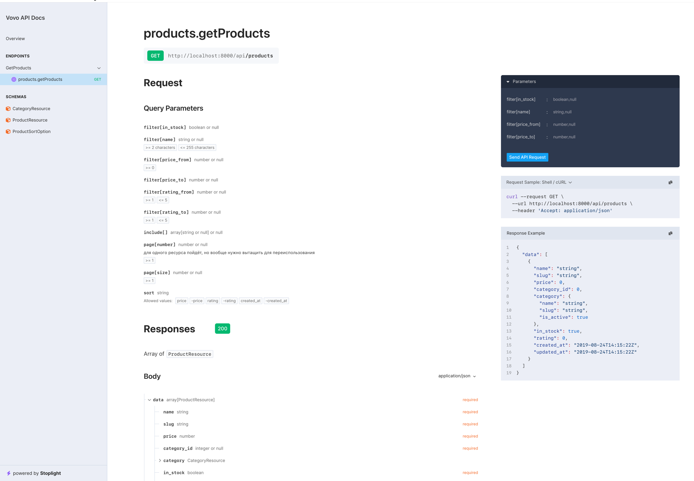

# Выполнение тестового от Vovo

## ТЗ
Реализовать поиск по товарам с фильтрами
Реализовать HTTP-endpoint (например, GET /api/products), который возвращает список товаров с возможностью фильтрации и сортировки.

У товара должны быть поля:
* id
* name (string, индекс по LIKE или FULLTEXT если захочешь)
* price (decimal)
* category_id (foreign key на таблицу categories)
* in_stock (boolean)
* rating (float, 0–5)
* created_at
* updated_at

Фильтры (через query-параметры):
* q — поиск по подстроке в name
* price_from, price_to
* category_id
* in_stock (true/false)
* rating_from

Сортировка:
параметр sort с допустимыми значениями: price_asc, price_desc, rating_desc, newest.

Обязательна пагинация.

Вы вправе делать шаги влево-вправо, главное иметь для этого объяснение почему так, а не по другому. Каждое уточнение будет засчитано и рассмотрено. Но имейте ввиду, что оно может оценить вас и в минус :)

Если что, можете оставлять комментарии в коде, чтобы при рассмотрении сразу было понимание чего к чему, но и сильно не перегибайте)

## Моё примечание к решению
Делал простое решение, без заморочек. Так как ТЗ не строгое, привёл API к [JSON API Specification](http://jsonapi.org/).

Из таблиц оставил только `migrations, categories, products`.

Код организовал модульно, но без использования laravel-modular (это тут лишнее).

Использовал паттерн Service Class.

Остальные примечания можно увидеть в комментариях к коду.

.env файлик оставил в репозитории для скорости. В проде, конечно, иной подход :)

## Сборка и запуск

`docker-compose up --build` — соберёт и запустит проект

## Сид тестовых данных
`docker exec -it vovo_app sh` — войти в контейнер

`php artisan db:seed --class=ProductSeeder` — заполнить базу тестовыми данными

## Документация
http://localhost:8000/docs/api

Можно выполнять запросы прямо с сайта документации. Справа окошко с кнопкой «Send API Request»

## Что использовалось
1. PHP 8.5
2. Laravel 12
3. [dedoc/scramble](https://scramble.dedoc.co/) — для документации
4. [spatie/laravel-query-builder](https://spatie.be/docs/laravel-query-builder/v6/introduction) — для упрощения работы с QueryBuilder на основе пришедшего Request
5. [spatie/laravel-json-api-paginate](https://github.com/spatie/laravel-json-api-paginate) — чтобы привести пагинацию к JSON API Specification
6. [barryvdh/laravel-ide-helper](https://github.com/barryvdh/laravel-ide-helper) — для удобства разработки
